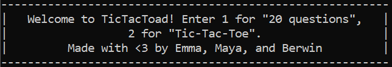
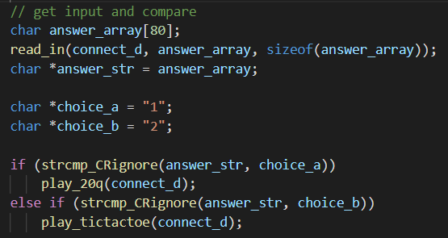
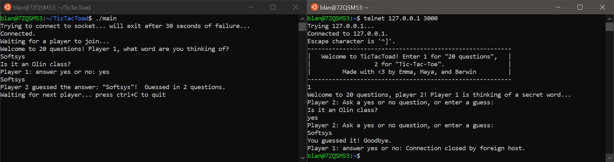
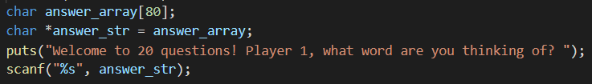
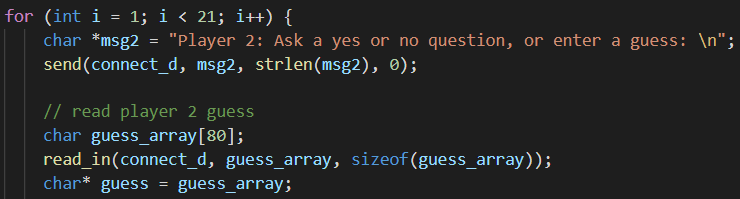
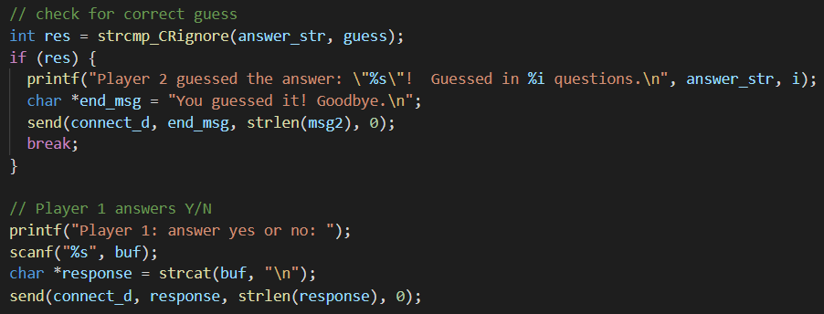
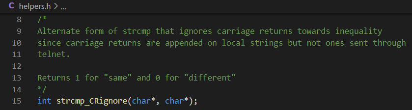

# Tic Tac Toad: Final Report

## Project Goals 

The baseline goal of this project was to allow two computers on the same network to play command-line games, such as tic-tac-toe. We also explored additional goals, such as implementing more games, allowing more than two users to participate, creating a setup shell script, designing a GUI, and being able to play against a simple AI.

## Project Outcomes 

Our final product is a program which [opens] a server and allows a client to connect.

[Insert screenshot of code snippets of socket stuff]

The client is greeted with a welcome “screen” with a simple GUI. By entering either `1` or `2`, they can choose to play 20 questions or tic-tac-toe with the person running the server. A string comparison is used to match to and call the appropriate game function.

### 20 Questions

The 20 questions game checks each of the client-side player’s guesses against the server-side player’s secret word, and ends the game once the word has been guessed or 20 questions have been asked (whichever happens first).

The server-side player thinks of a word and enters it and the game saves it to the string `answer_str`. This allows us to compare it to the guesses from the client.

The client asks a question, which is sent over the network to the server’s shell. The input from the client is stored as `guess`. The client gets 20 questions before the game automatically closes.

After the client makes their guess, the first thing the function does is compare it against `answer_str`. If `guess` and `answer_str` are identical, this means that the client has guessed the word and the game ends. Otherwise, the server replies to the client’s question with either yes or no, and their reply is sent back over the network to the client and the question-and-answer cycle repeats.

### Tic-tac-toe

The tic-tac-toe game sends back and forth a character-based ‘board’ and allows both players to edit the board by placing a mark on their respective turns. 

[add a few screenshots]

In addition to the main interactive game program, there is a setup script which installs library dependencies for you, and installs a command to boot up the server.

[insert setup script screenshot here] 

## Design Decisions 

We’d like to highlight a few design decisions we made that we think are interesting.

We focused on making our code modular and reusable by using header files and refactoring large functions into multiple smaller ones with helper functions. While we started off by writing all our code in the `main.c` file, this quickly became very large and unwieldy. 

We created `helper.h` and `helper.c` to store several common functions that were used across multiple other files, including error handling, reading input, and string comparison that worked with carriage returns. This helped avoid function redefinition errors, reduce our compilation time and time spent debugging, and make our overall file structure neater and more comprehensible. For example, we ran into a few edge cases that had to do with reading input from Telnet, and having functions like `strcmp_CRignore` that could handle these cases accessible from multiple game files was helpful. 

We also created a header file for game-related function definitions to run 20 questions, tic-tac-toe, and the game chooser. While the game functions weren’t as broadly used as the helper functions, we wanted to write clean and reusable code across the entire project. It also allows for more games to easily be added in the future since only the game chooser and games.h would need to be edited to include each new game.

## Learning

Berwin’s learning goals were to improve and expand her skills in C, in addition to building a basic understanding of how computers communicate across a network. She met these learning goals, got more comfortable working on software with a team, and got to work on the interactive aspect of the project through 20 questions and the game chooser.

Emma wanted to understand computer networking, get more practice using pointers, and learn about shell scripts. By kicking off the socket communication coding, she got an understanding of how servers and clients connect and communicate. She got a chance to practice her C coding throughout and in particular with 20 questions. She also got to learn how CLI tools work, and a bit about shell scripts, in her setup script. 

[Insert Maya learning here: Understanding how to have two computers communicate in real time and increasing my general competency in C]

## Resources
 
Here is a non-exhaustive list of the resources that we used throughout this project. We found _Head First C_ Chapter 11 particularly helpful for the initial network setup.
* [Resources from HackerChat SoftSys project](https://github.com/NathanShuster/hackerchat/blob/master/reports/report.md#resources)
* Griffiths, D. (2012). Head First C. O’Reilly Media.
* Specific resources for socket programming:
  * https://www.geeksforgeeks.org/socket-programming-cc/#:~:text=What%20is%20socket%20programming%3F,reaches%20out%20to%20the%20server
  * https://www.binarytides.com/socket-programming-c-linux-tutorial/
  * https://www.csd.uoc.gr/~hy556/material/tutorials/cs556-3rd-tutorial.pdf
